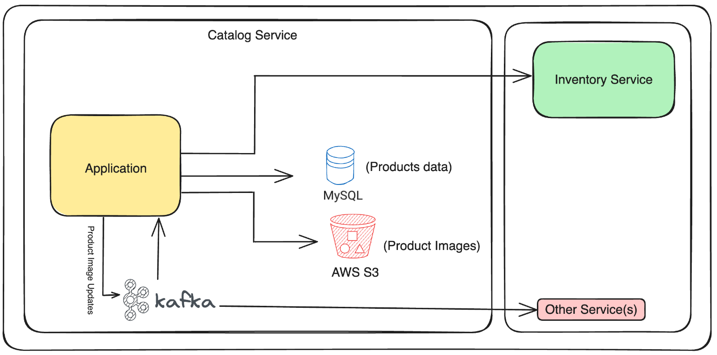

# Java Local Development Workshop

This repo will demo how to use Testcontainers \([https://www.testcontainers.com](https://www.testcontainers.com)\) in your Java application development process.

We will work with a Spring Boot application and show how to:
* Use Testcontainers for provisioning application dependent services like PostgreSQL, Kafka, LocalStack for local development
* Use [Testcontainers Desktop](https://testcontainers.com/desktop/) for local development and debugging
* Write tests using Testcontainers

## Exploring the app

The application we are working on is a microservice based on Spring Boot for managing a catalog of products.
It provides APIs to save and retrieve the product information.



### SQL database with the products

When a product is created, we will store the product information in our database.

Our database of choice is PostgreSQL, accessed with Spring Data JPA.

Check [com.testcontainers.catalog.domain.internal.ProductRepository](src/main/java/com/testcontainers/catalog/domain/internal/ProductRepository.java).

### LocalStack

We would like to store the product images in AWS S3 Object storage.
We will use [LocalStack](https://localstack.cloud/) to emulate the AWS cloud environment locally during local development and testing with [Spring Cloud AWS](https://awspring.io/).

Check [com.testcontainers.catalog.domain.internal.S3FileStorageService](src/main/java/com/testcontainers/catalog/domain/internal/S3FileStorageService.java).

### Kafka

When a product image is uploaded to AWS S3, an event will be published to Kafka.
The kafka event listener will then consume the event and update the product information with the image URL.

Check [com.testcontainers.catalog.domain.internal.ProductEventPublisher](src/main/java/com/testcontainers/catalog/domain/internal/ProductEventPublisher.java)
and [com.testcontainers.catalog.events.ProductEventListener](src/main/java/com/testcontainers/catalog/events/ProductEventListener.java).

### External Service Integrations
Our application talks to `inventory-service` to fetch the product availability information.
We will use [Microcks](https://microcks.io/) to mock the `inventory-service` during local development and testing.


### API Endpoints

The API is a Spring Web REST controller \(`com.testcontainers.catalog.api.ProductController`\) and exposes the following endpoints:

* `POST /api/products { "code": ?, "name": ?, "description": ?, "price": ? }` to create a new product
* `GET /api/products/{code}` to get the product information by code
* `POST /api/products/{code}/image?file=IMAGE` to upload the product image

# Getting Started
## Prerequisites

### Install Java 17 or newer
You'll need Java 17 or newer for this workshop.
Testcontainers libraries are compatible with Java 8+, but this workshop uses a Spring Boot 3.x application which requires Java 17 or newer.

We would recommend using [SDKMAN](https://sdkman.io/) to install Java on your machine if you are using MacOS, Linux or Windows WSL.

### Install Docker
You need to have a Docker environment to use Testcontainers.

* You can use [Testcontainers Cloud](https://testcontainers.com/cloud). If you are going to use Testcontainers Cloud, then you need to install [Testcontainers Desktop](https://testcontainers.com/desktop/) app.

### Install Testcontainers Desktop
[Testcontainers Desktop](https://testcontainers.com/desktop/) is a companion app for the open-source Testcontainers libraries
that makes local development and testing with real dependencies simple.

Download the latest version of Testcontainers Desktop app from [https://testcontainers.com/desktop/](https://testcontainers.com/desktop/)
and install it on your machine.

Once you start the Testcontainers Desktop application, it will automatically detect the container runtimes
installed on your system and allows you to choose which container runtime you want to use by Testcontainers.

## Compile the project to download the dependencies

With Maven:
```shell
./mvnw compile
```
# Local development environment with Testcontainers
Our application uses PostgreSQL, Kafka, and LocalStack.

Currently, if you run the `Application.java` from your IDE, you will see the following error:

```shell
***************************
APPLICATION FAILED TO START
***************************

Description:

Failed to configure a DataSource: 'url' attribute is not specified and no embedded datasource could be configured.

Reason: Failed to determine a suitable driver class

Action:

Consider the following:
	If you want an embedded database (H2, HSQL or Derby), please put it on the classpath.
	If you have database settings to be loaded from a particular profile you may need to activate it (no profiles are currently active).

Process finished with exit code 0
```

To run the application locally, we need to have these services up and running.

Instead of installing these services on our local machine, or using Docker Compose to run these services manually,
we will use [Spring Boot support for Testcontainers at Development Time](https://docs.spring.io/spring-boot/docs/current/reference/htmlsingle/#features.testing.testcontainers.at-development-time) to provision these services automatically.

> **NOTE**
>
> Before Spring Boot 3.1.0, Testcontainers libraries are mainly used for testing.
Spring Boot 3.1.0 introduced out-of-the-box support for Testcontainers which not only simplified testing,
but we can use Testcontainers for local development as well.
>
> To learn more, please read [Spring Boot Application Testing and Development with Testcontainers](https://www.atomicjar.com/2023/05/spring-boot-3-1-0-testcontainers-for-testing-and-local-development/)

First, make sure you have the following Testcontainers dependencies in your `pom.xml`:

```xml
<dependencies>
  <dependency>
    <groupId>org.springframework.boot</groupId>
    <artifactId>spring-boot-testcontainers</artifactId>
    <scope>test</scope>
  </dependency>
  <dependency>
      <groupId>org.testcontainers</groupId>
      <artifactId>postgresql</artifactId>
      <scope>test</scope>
  </dependency>
  <dependency>
      <groupId>org.testcontainers</groupId>
      <artifactId>kafka</artifactId>
      <scope>test</scope>
  </dependency>
  <dependency>
      <groupId>org.testcontainers</groupId>
      <artifactId>localstack</artifactId>
      <scope>test</scope>
  </dependency>
  <dependency>
      <groupId>io.github.microcks</groupId>
      <artifactId>microcks-testcontainers</artifactId>
      <version>${microcks-testcontainers-module.version}</version>
      <scope>test</scope>
  </dependency>
</dependencies>
```
## Testcontainers configuration explanation: ContainersConfig class
We have [com.testcontainers.catalog.ContainersConfig](src/test/java/com/testcontainers/catalog/ContainersConfig.java) class under `src/test/java` with configuration of the required containers.
What this configuration class does:
* `@TestConfiguration` annotation indicates that this configuration class defines the beans that can be used for Spring Boot tests.
* Spring Boot provides `ServiceConnection` support for `JdbcConnectionDetails` and `KafkaConnectionDetails` out-of-the-box.
  So, we configured `PostgreSQLContainer` and `KafkaContainer` as beans with `@ServiceConnection` annotation.
  This configuration will automatically start these containers and register the **DataSource** and **Kafka** connection properties automatically.
* Spring Cloud AWS doesn't provide ServiceConnection support out-of-the-box [yet](https://github.com/awspring/spring-cloud-aws/issues/793).
  But there is support for [Contributing Dynamic Properties at Development Time](https://docs.spring.io/spring-boot/docs/current/reference/htmlsingle/#features.testing.testcontainers.at-development-time.dynamic-properties).
  So, we configured `LocalStackContainer` as a bean and registered the Spring Cloud AWS configuration properties using `DynamicPropertyRegistry`.
* We also configured an `ApplicationRunner` bean to create the AWS resources like S3 bucket upon application startup.

## Microcks configuration explanation: InventoryServiceMockConfig class
Imagine you got an OpenAPI definition for the inventory service from the service provider.
You have `src/test/resources/inventory-openapi.yaml` with this content that will define the Mocks behaviour.
Once the Microcks server is started, we are registering the Microcks provided mock endpoint as `application.inventory-service-url`.
So, when we make a call to `inventory-service` from our application, it will call the Microcks endpoint instead.

## Run TestApplication class under src/test/java
Next, you have a [com.testcontainers.catalog.TestApplication](src/test/java/com/testcontainers/catalog/TestApplication.java) class under `src/test/java` to start the application with the Testcontainers configuration.

Run the `com.testcontainers.catalog.TestApplication` from our IDE and verify that the application starts successfully.

Now we have the working local development environment with PostgreSQL, Kafka, LocalStack, and WireMock.

You can invoke the APIs using CURL or Postman or any of your favourite HTTP Client tools.

### Create a product
```shell
curl -v -X "POST" 'http://localhost:8080/api/products' \
--header 'Content-Type: application/json' \
--data '{
"code": "P201",
"name": "Product P201",
"description": "Product P201 description",
"price": 24.0
}'
```
### Upload Product Image
```shell
curl -X "POST" 'http://localhost:8080/api/products/P101/image' \
--form 'file=@"/Users/siva/work/product-p101.jpg"'
```
### Get a product by code

```shell
curl -X "GET" 'http://localhost:8080/api/products/P101'
```

# Connect to services

In the previous step, we get our application running locally and invoked our API endpoints.

What if you want to check the data in the database or the messages in Kafka?

Testcontainers by default start the containers and map the exposed ports on a random available port on the host machine.
Each time you restart the application, the mapped ports will be different.
This is good for testing, but for local development and debugging, it would be convenient to be able to connect on fixed ports.

This is where **Testcontainers Desktop** helps you.

## Testcontainers Desktop
Testcontainers Desktop application provides several features that helps you with local development and debugging.
To learn more about Testcontainers Desktop, check out the [Simple local development with Testcontainers Desktop](https://testcontainers.com/guides/simple-local-development-with-testcontainers-desktop/) guide.

The Testcontainers Desktop app makes it easy to use fixed ports for your containers,
so that you can always connect to those services using the same fixed port.

## Connect to PostgreSQL database
Click on **Testcontainers Desktop → select Services → Open config location...**.

In the opened directory there would be a `postgres.toml.example` file.
Make a copy of it and rename it to `postgres.toml` file and update it with the following content:

```toml
ports = [
    {local-port = 5432, container-port = 5432},
]
selector.image-names = ["postgres"]
```

We are mapping the PostgreSQL container's port 5432 onto the host's port 5432.
Now you should be able to connect to the PostgreSQL database using any SQL client
with the following connection properties:

```shell
psql -h localhost -p 5432 -U test -d test
```

Similarly, you can connect to any of your containers using the same approach by using the port-mapping feature of Testcontainers Desktop.

# Use reusable containers

During the development, you will keep changing the code and verify the behavior either by running the tests
or running the application locally. Recreating the containers everytime you restart the application
might slow down your quick feedback cycle.

One technique that you can apply to speed up testing and local development is using the **reusable containers** feature.

Since you are using the Testcontainers Desktop, the `testcontainers.reuse.enable` flag is set automatically
for your dev environment.
You can enable or disable it by clicking on **Enable reusable containers** option under **Preferences**.

Once the `reuse` feature is enabled, you need to configure which containers should be reused using the Testcontainers API.
With Testcontainers for Java API, you can achieve this using `.withReuse(true)` as follows:

```java
@TestConfiguration(proxyBeanMethods = false)
public class com.testcontainers.catalog.ContainersConfig {

    @Bean
    @ServiceConnection
    PostgreSQLContainer<?> postgresContainer() {
        return new PostgreSQLContainer<>(parse("postgres:16-alpine")).withReuse(true);
    }
}
```

* When you first start the application, the containers will be created.
* When you stop the application, the containers will continue to run.
* When you restart the application again, the containers will be reused.

If you no longer want to keep the containers running, then you can remove them by clicking on **Testcontainers Desktop → Terminate containers**.

# SetUp for Testing
So far, we focused on being able to run the application locally without having to install or run any dependent services manually.
But there is nothing more painful than working on a codebase without a comprehensive test suite.

## Common Test SetUp
For all the integration tests in our application, we need to start PostgreSQL, Kafka, LocalStack and Microcks containers.
So, we have a [com.testcontainers.catalog.tests.BaseIntegrationTest](src/test/java/com/testcontainers/catalog/tests/BaseIntegrationTest.java) class under `src/test/java` with the common setup as follows:

* We have reused the `com.testcontainers.catalog.ContainersConfig` class that we created in the previous steps to define all the required containers.
* We have configured the `spring.kafka.consumer.auto-offset-reset` property to `earliest` to make sure that we read all the messages from the beginning of the topic.
* We have configured the `RestAssured.port` to the dynamic port of the application that is started by Spring Boot.

## Tests for ProductController API endpoints
For running tests with predefined test data set we have [src/test/resources/test-data.sql](src/test/resources/test-data.sql).

Set of integration test can be found in [ProductControllerTest](src/test/java/com/testcontainers/catalog/api/ProductControllerTest.java) and [ProductControllerTestNegative](src/test/java/com/testcontainers/catalog/api/ProductControllerTestNegative.java) with:
* test to successfully create a new product (createProductSuccessfully)
* test to successfully upload product image (shouldUploadProductImageSuccessfully)
  * This test checks the following:
    * Before uploading the image, the product image URL is null for the product with code P101. 
    * Invoke the Product Image Upload API endpoint with the sample image file. 
    * Assert that the response status is 200 and the response body contains the image file name. 
    * Assert that the product image URL is updated in the database after the image upload.
* test to get the product information by code (getProductByCodeSuccessfully)
  * This test checks the following:
    * Create a new product with code P101. 
    * Invoke the Get Product API endpoint with the product code P101. 
    * Assert that the response status is 200 and the response body contains the product information. 
    * Assert that the product information is correct.
* test to get product by code API fails if the product code does not exist (getProductByCodeFails)
  * This test checks the following:
    * Invoke the Get Product API endpoint with a non-existing product code. 
    * Assert that the response status is 404 and the response body contains the error message.
* test to that our `ProductController` is in conformance to openAPI definition (checkOpenAPIConformance) 
  * Let's understand what's going on behind the scenes:
    * We complete the Microcks container with our additional `catalog-openapi.yaml` artifact file (this could have also
      been done within the `ContainersConfig` class at bean initialisation).
    * We prepare a `TestRequest` object that allows to specify the scope of the conformance test. Here we want to check the
      conformance of `Catalog Service` with version `1.0` that are the identifier found in `catalog-openapi.yaml`.
    * We ask Microcks to validate the `OpenAPI Schema` conformance by specifying a `runnerType`.
    * We ask Microcks to validate the localhost endpoint on the dynamic port provided by the Spring Test
      (we use the `host.testcontainers.internal` alias for that). 
    * Finally, we're retrieving a `TestResult` from Microcks containers, and we can assert stuffs on this result, checking it's a success. During the test, Microcks has reused all the examples found in the `catalog-openapi.yaml` file to issue requests to
      our running application. It also checked that all the received responses conform to the OpenAPI definition elements:
      return codes, headers, content-type and JSON schema structure.
* test that the same product will not be created multiple times (doesNotCreateProductIfProductCodeExists)
  * This test checks the following:
    * Create a new product with code P101. 
    * Invoke the Create Product API endpoint with the same product code P101. 
    * Assert that the response status is 409 and the response body contains the error message.
* test that product will not be created if payload is invalid (doesNotCreateProductIfPayloadInvalid)
  * This test checks the following:
    * Invoke the Create Product API endpoint with an invalid payload. 
    * Assert that the response status is 400 and the response body contains the error message.
* test that we can't get a product and by incorrect code and receive appropriate message(doesNotGetProductByCodeIfCodeNotExist)
  * This test checks the following:
    * Invoke the Get Product API endpoint with a non-existing product code. 
    * Assert that the response status is 404 and the response body contains the error message.


Now you can run tests from yur IDE or with Maven
```shell
./mvnw spotless:apply clean test
```

# GitHub Actions Integration

Now let's run our Testcontainers-based tests in CI. As we already learned we need to have a Docker environment to use Testcontainers. GitHub Actions supports Docker by default.
But what to do if your CI platform requires additional Docker installation (you'll end up with DinD to run Testcontainers tests, that is not a best practice) or doesn't support Docker at all?

The solution is to use Testcontainers Cloud!
You can simply:
* [Create a new service account](https://app.testcontainers.cloud/dashboard/services) in Testcontainers Cloud Webapp
* Set the TC_CLOUD_TOKEN environment variable
* Install and start Testcontainers Cloud agent using the installation script before you run your tests, as it shown in the [.github/workflows/maven.yml](.github/workflows/maven.yml)

Now if you create a new git branch and push the changes, your Testcontainers-base integration test will run with Testcontainers Cloud in CI without much additional effort.
